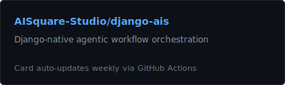

# awesome-aisquare

<div align="center">
  <!-- Replace the URL below with your own demo GIF or screenshot -->
  
</div>

<br/>

Audit, trust, and governance infrastructure for agentic AI systems.

<div align="center">

[](https://github.com/AISquare-Studio/awesome-aisquare/stargazers)
[](LICENSE)
[](https://docs.aisquare.studio)
[](CONTRIBUTING.md)

</div>

## What is AISquare

Your AI agents are making decisions. Hopefully good ones. But can you prove it?

AISquare is the governance layer for AI agents. It records *why* decisions are made, enforces policies on what agents can do, and gives humans structured workflows to review, approve, or intervene — without replacing your existing agent framework. Think of it as the system of record for AI decisions, the same way financial systems track transactions. Except the transactions are "the AI decided to email your CEO at 3 AM."

This repo is your starting point.

## Ecosystem map

Click on a card to explore the project. ⭐ Star your favorites to show support!

<div align="center">
  <a href="https://github.com/AISquare-Studio/awesome-aisquare">
    
  </a>
</div>

<div align="center">
  <a href="https://github.com/AISquare-Studio/AISquare-Studio-QA">
    
  </a>
  &nbsp;&nbsp;
  <a href="https://github.com/AISquare-Studio/django-ais">
    
  </a>
</div>

### 📋 Case study

<div align="center">
  <a href="https://on-anmols-mind.aisquare.studio/s/?type=note&id=4425&rid=990&ruid=0daa89e6-a7fd-40fc-9341-9db1c671a96a">
    
  </a>
  <br/><br/>
  <a href="https://on-anmols-mind.aisquare.studio/s/?type=note&id=4425&rid=990&ruid=0daa89e6-a7fd-40fc-9341-9db1c671a96a"></a>
</div>

### 🔜 Coming soon

<div align="center">

| Project | Description |
|:--------|:------------|
| **aisquare-examples** | Runnable governance scenario examples |
| **aisquare-templates** | Starter scaffolds for governed AI apps |
| **aisquare-integrations** | Adapters for LangChain, CrewAI, AutoGen |
| **AISquare SDK** | Client libraries for direct API integration |

</div>

## Quick links

<div align="center">
  <a href="https://docs.aisquare.studio"></a>
  <a href="https://docs.aisquare.studio/api-reference"></a>
  <a href="https://aisquare.studio"></a>
  <a href="https://feedback.aisquare.studio"></a>
  <a href="CONTRIBUTING.md"></a>
</div>

## Get started in 5 minutes

### AutoQA — AI-powered test generation

Turn plain-English test descriptions in your PRs into Playwright tests. Yes, really.

**1. Add the workflow** to `.github/workflows/autoqa.yml`:

```yaml
name: AutoQA
on:
  pull_request:
    types: [opened, edited, synchronize]

jobs:
  autoqa:
    runs-on: ubuntu-latest
    steps:
      - uses: actions/checkout@v4
      - uses: AISquare-Studio/AISquare-Studio-QA@main
        with:
          openai_api_key: ${{ secrets.OPENAI_API_KEY }}
          staging_url: ${{ secrets.STAGING_URL }}
          mode: generate
```

**2. Configure secrets** — add `OPENAI_API_KEY` and `STAGING_URL` to your repo's GitHub Actions secrets.

**3. Write tests in your PR body** using an `autoqa` block:

````markdown
```autoqa
1. Navigate to the login page
2. Enter valid credentials
3. Verify the dashboard loads
```
````

Open the PR. AutoQA generates and commits Playwright tests automatically. Modes: `generate` (single test), `suite` (full suite), `all` (everything).

Full docs: [AISquare-Studio-QA](https://github.com/AISquare-Studio/AISquare-Studio-QA)

---

### django-ais — Django-native agent orchestration

Orchestrate agentic workflows inside your existing Django stack — Postgres, Celery, Channels, ORM. No new infrastructure, no new religion.

> **Note:** django-ais is in pre-release. The API may change. Pin your versions like a responsible adult.

```bash
pip install django-ais
```

```python
# settings.py
INSTALLED_APPS = [
    ...
    "django_ais",
]

# workers.py
from django_ais import Worker

class SummaryWorker(Worker):
    name = "summarizer"

    def execute(self, job):
        return {"summary": summarize(job.payload["text"])}
```

Define workflows in YAML, stream events over SSE/WebSocket, and manage jobs through the Django ORM.

Full docs: [django-ais](https://github.com/AISquare-Studio/django-ais)

## How the pieces fit together

```
┌─────────────────┐     ┌──────────────────┐     ┌──────────────────┐
│   Your Agent    │────▶│  AISquare Gov't  │────▶│     AutoQA       │
│ (any framework) │     │ (audit + policy) │     │ (test generation)│
└─────────────────┘     └──────────────────┘     └──────────────────┘
                                │
                                ▼
                        ┌──────────────────┐
                        │    django-ais    │
                        │ (orchestration)  │
                        └──────────────────┘
```

Your agent framework handles reasoning. AISquare handles the "wait, should you actually do that?" part — recording decisions, enforcing policies, and routing to human review. AutoQA validates behavior through generated tests. django-ais orchestrates multi-step workflows inside Django.

## LLM-friendly docs

This repo ships [`llms.txt`](llms.txt) and [`llms-full.txt`](llms-full.txt) — structured text files designed for AI-native developer tools. Paste the raw URL into Cursor's `@Docs`, feed it to Claude or ChatGPT for project context, or use it with any tool that consumes plain-text documentation. Let your AI learn about the AI governance tool. It's not as meta as it sounds.

## Contributing

We welcome contributions across the entire ecosystem. See [CONTRIBUTING.md](CONTRIBUTING.md) for guidelines.

Issues tagged **"good first issue"** across all repos in the [AISquare-Studio org](https://github.com/AISquare-Studio) are a great entry point. No contribution is too small — typo fixes have mass-merged their way into many a changelog.

## Community and support

- [Feedback board](https://feedback.aisquare.studio) — Feature requests, bug reports, and the occasional "have you considered..."
- [Documentation](https://docs.aisquare.studio) — Guides, API reference, and tutorials
- [GitHub Discussions](https://github.com/orgs/AISquare-Studio/discussions) — Questions and community conversation
- [Security](SECURITY.md) — Responsible disclosure policy
- Email: [bots@aisquare.com](mailto:bots@aisquare.com)

## License

[Apache-2.0](LICENSE) — use it, fork it, govern your agents with it.
